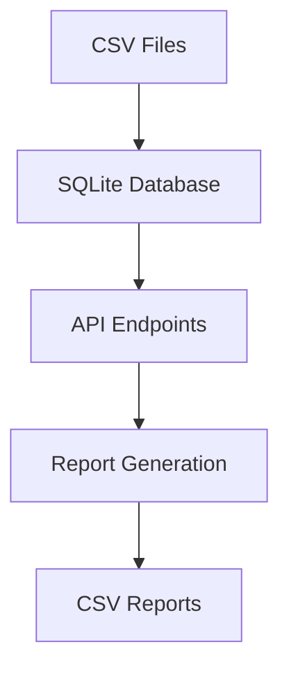
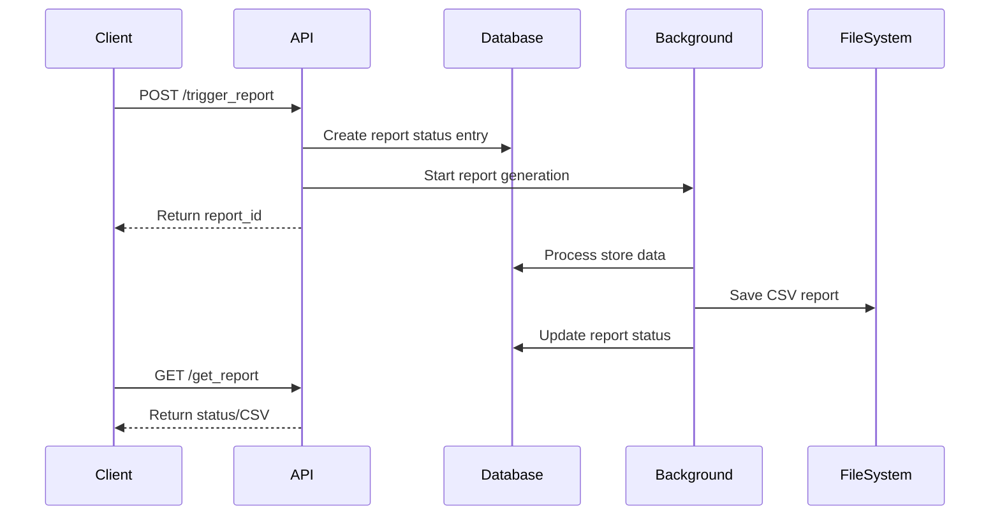

# Restaurant Monitoring API

An API service to monitor restaurant uptime and downtime during business hours. Loop Assignment

## Setup and Installation

0. Save all the csv files in a directory named "data" in the root directory 

1. Install the required packages:

```bash
pip install -r requirements.txt
```

2. Initialize the sqlite database: 
```bash
python src/data_loader_script.py
```

3. Run the FastAPI app: 
```bash
python src/main.py
```

## Running the App with Docker

1. Build the Docker image:

```bash
docker build -t restaurant-monitoring-api .
```

2. Run the Docker container:

```bash
docker run -p 8000:80 restaurant-monitoring-api
```

# Restaurant Monitoring System - Technical Approach

## 1. System Architecture

### Data Storage


### Database Schema
````sql
-- Database Schema
CREATE TABLE store_status (
    id INTEGER PRIMARY KEY,
    store_id TEXT,
    timestamp_utc DATETIME,
    status TEXT
);

CREATE TABLE business_hours (
    id INTEGER PRIMARY KEY,
    store_id TEXT,
    day_of_week INTEGER,  -- 0=Monday, 6=Sunday
    start_time_local TIME,
    end_time_local TIME
);

CREATE TABLE timezone (
    id INTEGER PRIMARY KEY,
    store_id TEXT UNIQUE,
    timezone_str TEXT
);

CREATE TABLE report_status (
    id INTEGER PRIMARY KEY,
    report_id TEXT UNIQUE,
    status TEXT,
    created_at DATETIME,
    completed_at DATETIME
);
````

## 2. Data Processing Pipeline

### Step 1: Data Loading
- Load CSV files in chunks to handle large datasets
- Process data with proper error handling and validation
- Convert timestamps and time zones appropriately

### Step 2: Business Logic
```python
def calculate_uptime_downtime(store_id, current_time):
    1. Get store's timezone and business hours
    2. Define time ranges (hour/day/week)
    3. Query store status within ranges
    4. Filter observations to business hours only
    5. Calculate uptime/downtime ratios
    6. Interpolate for missing data points
```

### Step 3: Report Generation


## 3. Key Components

### FastAPI Application Structure
````plaintext
src/
├── main.py           # FastAPI application and endpoints
├── database.py       # Database models and connection
├── services.py       # Business logic and report generation
├── data_loader.py    # CSV data loading functionality
└── logger.py         # Logging configuration
````

### API Endpoints
1. `POST /trigger_report`
   - Triggers async report generation
   - Returns unique report_id

2. `GET /get_report?report_id=<id>`
   - Checks report status
   - Returns CSV file when complete

## 4. Key Features

### Error Handling
- Graceful handling of missing data
- Default timezone (America/Chicago)
- Default business hours (24/7)
- Chunk-based processing for large files

### Performance Optimization
- Background task processing
- Database indexing
- Batch processing
- Memory-efficient data loading

### Data Validation
- Timestamp parsing and validation
- Time zone conversion
- Business hours validation
- Data completeness checks

## 5. Report Format

````csv
store_id,uptime_last_hour,uptime_last_day,uptime_last_week,downtime_last_hour,downtime_last_day,downtime_last_week
1234,45,22,150,15,2,18
````

## 6. Dependencies

````plaintext
fastapi==0.68.1
uvicorn==0.15.0
pandas==1.3.3
sqlalchemy==1.4.23
python-multipart==0.0.5
python-dotenv==0.19.0
pytz==2021.1
aiofiles==0.7.0
````

## Example Requests

### 1. Trigger Report Generation
```bash
curl -X POST http://localhost:8000/trigger_report
```

### 2. Check Status/Download Report
```bash
curl -X GET -O -J "http://localhost:8000/get_report?report_id=YOUR_REPORT_ID"
```

# Testing the Restaurant Monitoring API

Here are the curl commands to test the API endpoints:

## 1. Trigger Report Generation

```bash
curl -X POST http://localhost:8000/trigger_report
```

Expected Response:
```json
{
    "report_id": "f8c3de3d-1fea-4d7c-a8b0-29f63c4c3454"
}
```

## 2. Get Report Status/Download

```bash
# Replace YOUR_REPORT_ID with the ID received from trigger_report
curl -X GET -O -J "http://localhost:8000/get_report?report_id=YOUR_REPORT_ID"
```

### Alternative for Windows PowerShell:

```powershell
# Trigger report
$response = Invoke-RestMethod -Method POST -Uri "http://localhost:8000/trigger_report"
$reportId = $response.report_id

# Get report/download file
Invoke-WebRequest -Uri "http://localhost:8000/get_report?report_id=$reportId" -OutFile "report.csv"
```

The GET request will either return:
- `{"status": "Running"}` if the report is still being generated
- A CSV file download if the report is complete
- An error message if something went wrong

This approach provides a scalable, maintainable solution that handles large datasets efficiently while maintaining data integrity and providing clear error handling and logging.